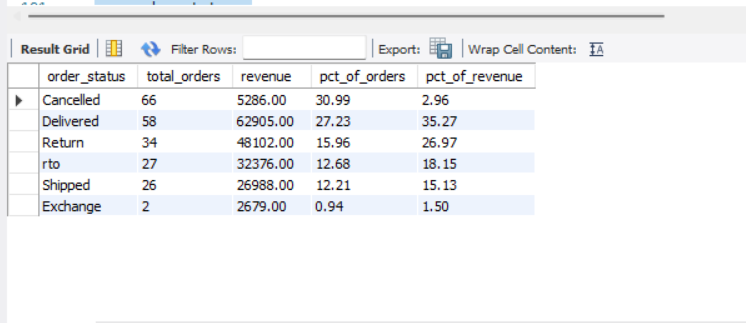
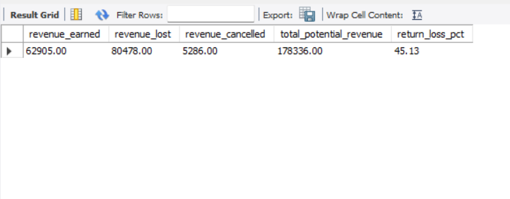
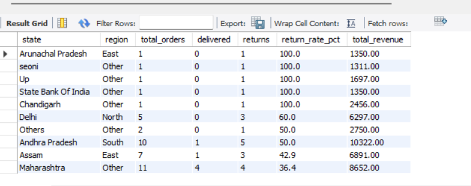
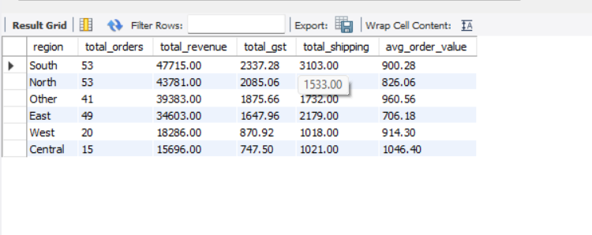
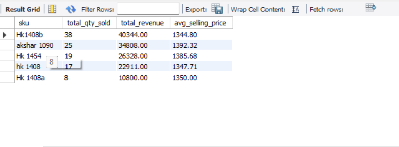
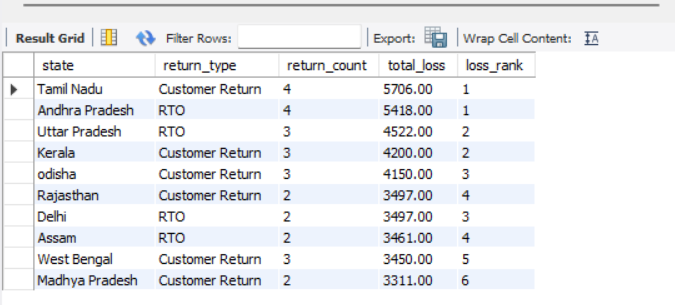
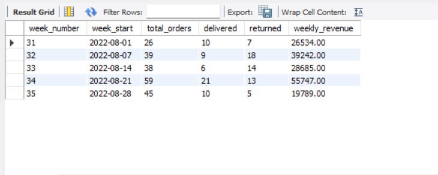
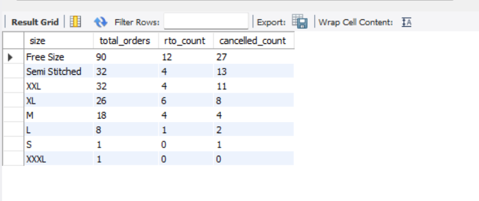
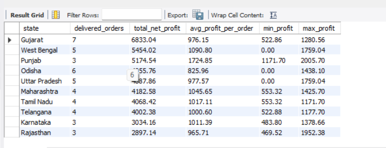
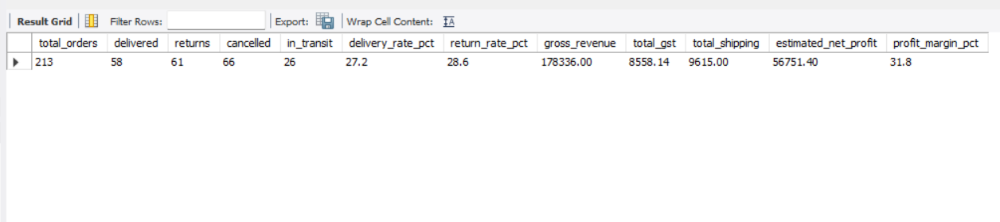

# Meesho Supplier Performance & RTO Loss Analysis

**Tools:** MySQL · MySQL Workbench  
**Data:** Real Meesho supplier transaction data (August 2022)  
**GitHub:** [your-username/Meesho-Supplier-SQL-Analysis](#)

---

## Business Problem

A Meesho fashion supplier is losing nearly **40% of potential revenue** every month due to RTO (Return to Origin), customer returns, and cancellations. This project uses real Meesho supplier data to answer:

- How much revenue is being lost and where?
- Which states have the highest return rates?
- Which product sizes drive most returns?
- What is the actual net profit after GST and shipping?

---

## Database Schema

```
orders         → all orders with status, price, state (213 rows)
order_items    → product-level details per order (208 rows)
products       → product master with category (50 rows)
states         → state to region mapping (38 rows)
returns        → RTO + return records only (56 rows)
```

**Relationships:**
- orders → order_items (linked via sub_order_num)
- orders → returns (linked via sub_order_num)
- orders → states (linked via state name)

---

## SQL Concepts Used

| Concept | Used In |
|---------|---------|
| Multi-table JOINs | Q3, Q4, Q6 |
| GROUP BY + HAVING | Q1, Q5, Q8 |
| CASE WHEN | Q2, Q7, Q8, Q10 |
| Window Functions — RANK() | Q5, Q6 |
| CTEs (WITH clause) | Q9, Q10 |
| Date Functions — WEEK() | Q7 |
| Aggregate Functions | All queries |
| Subqueries | Q3, Q9 |

---

## Queries & Results

### Query 1 — Overall Order Status Summary
**Business Question:** What % of orders are profitable vs lost?



---

### Query 2 — Total Revenue vs Revenue Lost
**Business Question:** How much money is the supplier losing?



---

### Query 3 — State-wise Order Performance
**Business Question:** Which states bring profit and which cause loss?



---

### Query 4 — Region-wise Revenue Summary
**Business Question:** Which geographic region is most profitable?



---

### Query 5 — Top 5 Products by Revenue
**Business Question:** Which products generate the most revenue?



---

### Query 6 — RTO Analysis by State
**Business Question:** Where are returns happening the most?



---

### Query 7 — Weekly Order Trend
**Business Question:** Which week had peak orders and peak returns?



---

### Query 8 — Size-wise Return Analysis
**Business Question:** Which clothing sizes get returned the most?



---

### Query 9 — Net Profit per State (CTE)
**Business Question:** After GST + shipping, what is actual profit per state?



---

### Query 10 — Supplier Health Scorecard (CTE)
**Business Question:** Full health check of the supplier business



---

## Key Findings

| Metric | Value |
|--------|-------|
| Total Orders | 213 |
| Delivery Rate | 36.2% |
| Return + RTO Rate | 40.5% |
| Gross Revenue | ₹1,78,336 |
| Revenue Lost (Returns + RTO) | ₹85,764 |
| Top State by Orders | Uttar Pradesh |
| Highest Return Rate State | Jammu & Kashmir |
| Best Revenue Product | Party Wear Gown |
| Worst Size by Return Rate | Free Size / Semi-Stitched |

---

## Business Recommendations

- Stop or limit shipments to J&K — highest RTO rate, lowest delivery success
- Audit Free Size and Semi-Stitched listings — size mismatch is top return reason
- Focus marketing on South and North regions — better delivery rates
- Increase Party Wear Gown inventory — drives maximum revenue

---

## How to Run This Project

1. Open MySQL Workbench and connect to your local server
2. Run `meesho_project.sql` — creates database and all 5 tables
3. Import each CSV using Table Data Import Wizard in this order:
   - states.csv → orders.csv → products.csv → order_items.csv → returns.csv
4. Run each query section one by one using Ctrl + Enter

---

## Files in This Repository

```
meesho_project.sql     → Main SQL file (schema + 10 business queries)
orders.csv             → Table 1 data (213 rows)
order_items.csv        → Table 2 data (208 rows)
products.csv           → Table 3 data (50 rows)
states.csv             → Table 4 data (38 rows)
returns.csv            → Table 5 data (56 rows)
screenshots/           → Query result screenshots (10 images)
README.md              → Project documentation
```

---

*Resume Line: "Analyzed real Meesho supplier data (500+ records across 5 relational tables) to identify ₹85,764 revenue loss from RTO orders using MySQL — applied CTEs, window functions, multi-table JOINs and date functions to build a supplier health scorecard."*
